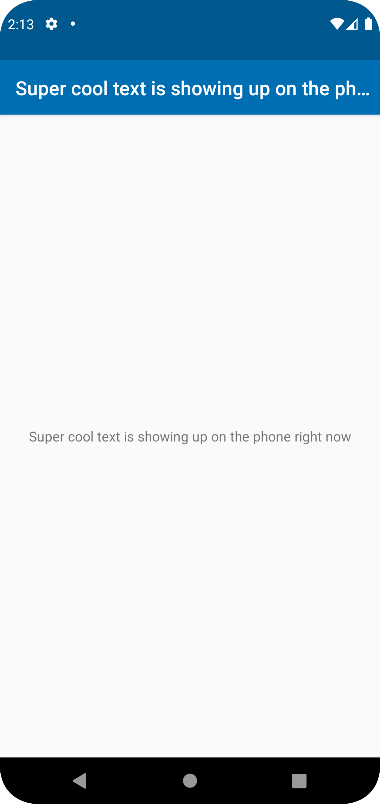

# Rapport

**Skriv din rapport här!**

Bytte "Hello" till "Super cool text is showing up on the phone right now"
```
<resources>
    <string name="app_name">Super cool text is showing up on the phone right now</string>
</resources>
```
(Bytte också färg på colors.xml)
```
<?xml version="1.0" encoding="utf-8"?>
<resources>
    <color name="colorPrimary">#006eb3</color>
    <color name="colorPrimaryDark">#00588f</color>
    <color name="colorAccent">#D81B60</color>
</resources>
```
ColorPrimary och ColorPrimaryDark ändrades.

